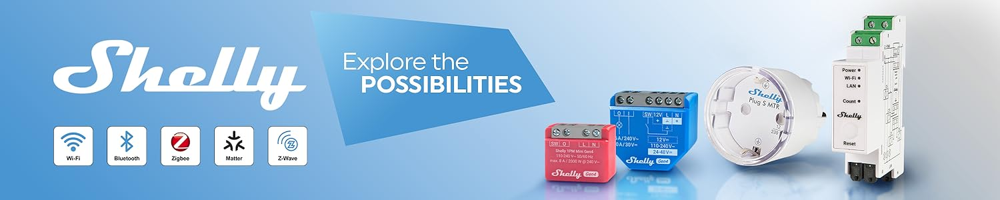

  

---

---

---

# Scripts pour modules Shelly

Vous trouvez ici des exemples de scripts pour les modules Shelly, désormais en partage et conçus par mes soins pour mon usage personnel.  
Ces scripts sont introuvables ici sur GitHub (même en anglais) et encore moins sur le site du constructeur, qui vend ses modules sans instructions ni notice technique détaillée.  
Seule une notice sommaire est fournie, destinée à une première utilisation : le strict minimum, en résumé.  

Non seulement le fournisseur prive ses clients de documentations d’utilisation complètes (même pas en ligne, alors qu’il doit bien connaître, au minimum pour lui‑même, le fonctionnement de son matériel), mais il propose désormais des cours payants pour ceux qui souhaitent accéder à ce type de documentation.  
La modernité…

Je note plusieurs avantages remarquables sur les produits de ce fabricant, par rapport à tout autre produit du marché :

- Interface d’utilisation accessible à tous, réellement bien pensée, organisée et présentée (très très rare).  
  Un grand merci au graphiste pour son travail exceptionnel, qui offre un rendu visuel parfait.

**Dans tous les cas:** Par l'utilisation d'un simple sript (voir mes exemples) vous avez la possibilité de mettre en place des scénarios très sympa et intéressants, par exemple conditionner l'alimentation d'un radiateur face à une porte ou fenetre ouverte juste à coté, de déclencher l'éclairage (éventuellement temposidée ainsi que spécialement tamisée) d'une terrasse  ou autre zone à l'ouverture d'une porte ou en franchissant un seuil, (donc avec un petit detecteur de mouvement shelly, envoyant une simple impulsion bluetooth) et seulement s'il y a une certaine obscurité, etc..... 

---

## Un module Shelly

Un module Shelly :

- Fonctionne sans Internet.  
- Fonctionne sans réseau.  

… même pour répondre à une commande entre appareils (via communication Bluetooth ou Zigbee), ou pour orchestrer et automatiser des actions et scénarios complexes.

La création et l’utilisation de scripts JavaScript dans ces modules apporte des avantages (notamment l’autonomie), mais aussi des inconvénients pour l’utilisateur “classique”, tant pour profiter du fonctionnement sous script que pour le paramétrage des scénarios sans recours au cloud (qui est surtout utile pour les interactions entre modules).

- Paramétrage complexe et non intuitif, réservé à un utilisateur de profil technique, initié et équipé.  
  (Scripts codés en JavaScript sous de nombreuses contraintes et limites.)  
- Contraintes d’accessibilité : adresse IP fixe nécessaire pour chaque module.  
- Ajout de matériel impossible sans l’application officielle + accès à Internet (liaison en temps réel avec les serveurs privés Shelly “cloud”).

---

## Avantages d’une gestion sans cloud

Avantages d’une gestion des scénarios sans cloud (par rapport à de nombreux produits concurrents) :

- Fonctionne sans accès Internet.  
- Interactions autonomes entre les modules.
- (à compléter !)...

---

## Études de conception

Des études de conception peuvent être réalisées sur demande, via le formulaire de contact disponible sur mon site :  
[formulaire de contact](https://prestazur.fr/contact).

---

### À noter

- **Cloud** (notion) = utilisation obligatoire des serveurs privés Shelly, liée à Internet + abonnement actif.
